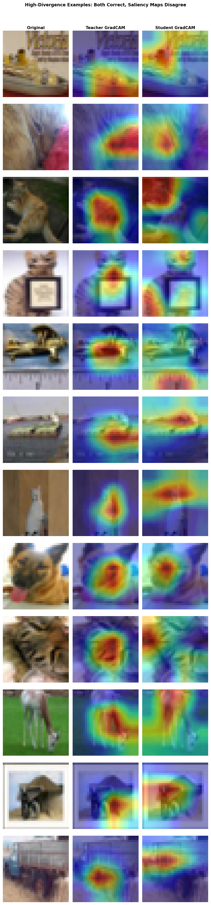
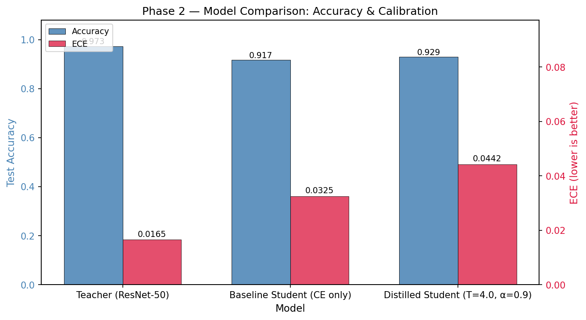
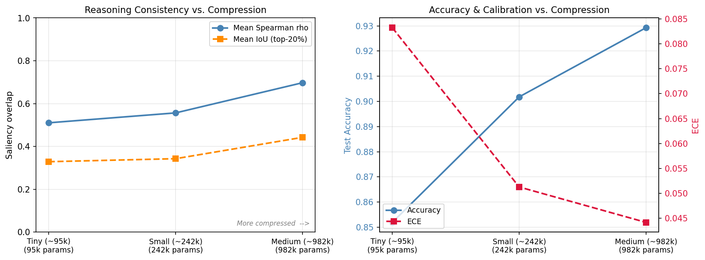
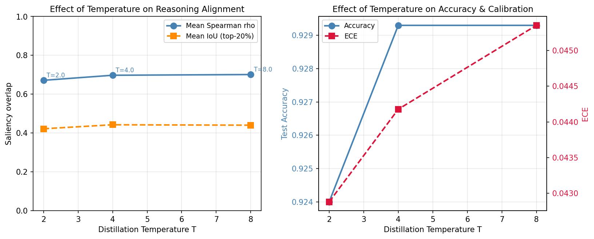
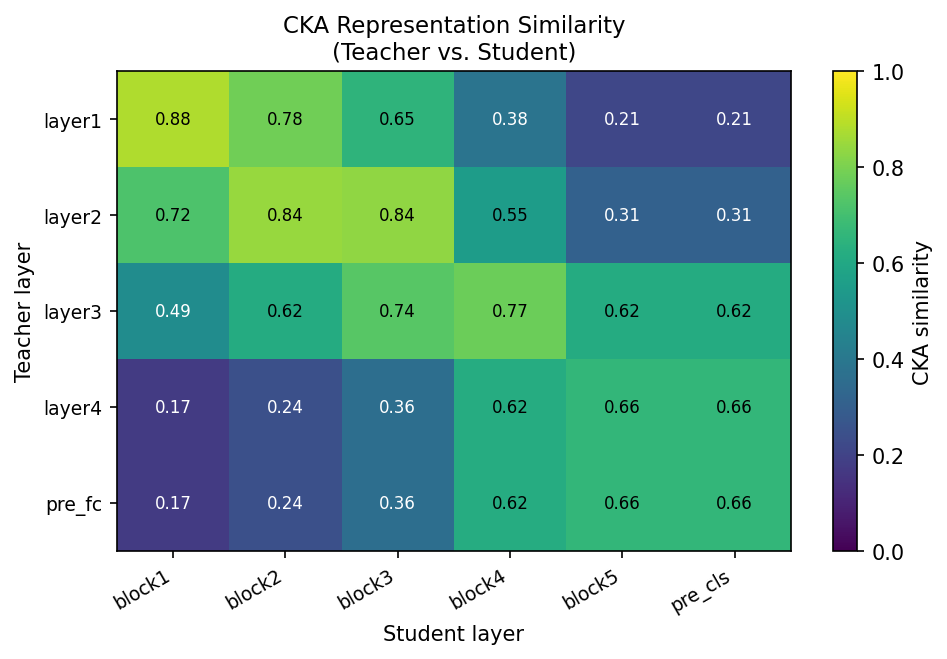
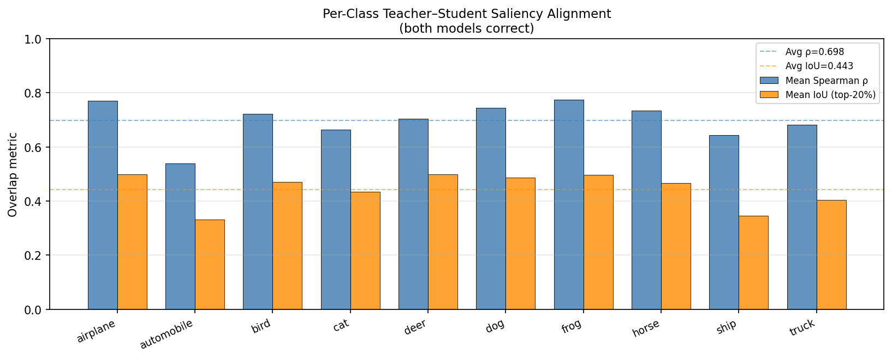
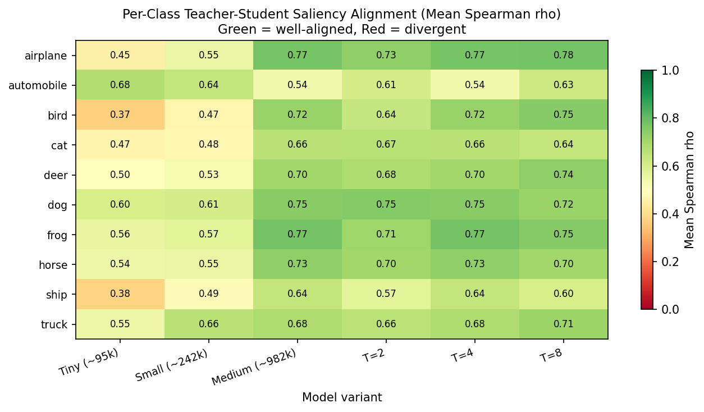

# Auditing Reasoning Consistency Under Knowledge Distillation

*Does a compressed model get the right answer for the right reasons?*

Knowledge distillation compresses large models into small ones for edge deployment, but accuracy alone hides whether the compressed model actually reasons like its teacher. This project measures reasoning consistency directly: GradCAM saliency maps are compared between a ResNet-50 teacher (97.31% accuracy) and student variants ranging from 24× to 248× compressed, using Spearman rank correlation and IoU on the top-20% activated pixels. The central finding is that accuracy and reasoning consistency degrade at different rates under compression, and some classes show high accuracy paired with low reasoning consistency, the clearest sign of shortcut learning. Temperature turns out to be a reasoning-consistency dial more than an accuracy dial: T=2 and T=8 reach near-identical accuracy (92.40% vs 92.93%) but meaningfully different reasoning consistency (ρ=0.672 vs 0.701).

## Key Findings

1. **Distillation improves accuracy but degrades calibration.** Distillation lifts student accuracy from 91.71% to 92.93%, a 1.22 pp gain over a cross-entropy baseline. ECE worsens from 0.0325 to 0.0442 over the same change. The teacher's confidence transfers more readily than its accuracy: 90.48% of distilled-student predictions land in the highest confidence bin (>0.933), yet accuracy there is 96.74%, against the teacher's 98.75% in the same bin.

2. **Reasoning consistency is meaningfully below perfect.** On the 9,196 test images where teacher and student both predict correctly, mean Spearman ρ is 0.6976 and mean IoU on the top-20% activated pixels is 0.4426. Less than half of the regions the teacher most attends to overlap with the student's. The most extreme case has ρ=−0.5679: both models answer correctly, but their saliency maps are negatively correlated.

3. **Automobile and ship show the clearest shortcut learning.** These two classes sit among the highest student accuracies (96.3% and 95.2%) while posting the lowest reasoning consistencies (ρ=0.538 and 0.644). The pattern holds across every temperature tested (automobile ρ ranges 0.538–0.626 across T∈{2,4,8}), which rules out a training artefact. A deployer relying on accuracy alone would have no indication the model attends to different features than the teacher.

4. **Compression degrades reasoning consistency faster than accuracy.** Going from medium (24×, 982k params) to tiny (248×, 95k params) costs 8.1 pp of accuracy but 18.7 pp of reasoning consistency (ρ: 0.698 → 0.510). The tiny model is also unpredictably inconsistent: σ(ρ) rises from 0.159 to 0.268, so some images are well-explained and others are not, with no way to know which at inference time.

5. **Temperature is a trustworthiness dial, not an accuracy dial.** T=2 gives the best calibration (ECE=0.0429) but the lowest reasoning consistency (ρ=0.672). T=8 gives the best reasoning consistency (ρ=0.701) but the worst calibration (ECE=0.0454). Accuracy barely moves (92.40% vs 92.93%). For edge deployment, the right temperature depends on which trustworthiness property matters more; accuracy alone will not help you choose.


*12 examples where teacher and student agree on the answer but disagree on where to look. The most extreme case has ρ=−0.5679.*

## Method

### Models

The teacher is a pretrained ResNet-50 fine-tuned to 97.31% on CIFAR-10. The standard ResNet stem gets replaced with a 3×3 conv1 and no maxpool so the network operates at native 32×32 resolution. This avoids introducing a resolution confound when comparing saliency maps later. 96.06% of teacher predictions fall in the highest confidence bin with 98.75% accuracy there, so the teacher is both accurate and well-calibrated on the task.

Three student variants are trained from scratch with Hinton-style KD loss (α=0.9): tiny (95k params, 248× compression), small (242k, 97×), and medium (982k, 24×). The variants differ in both depth and width. Tiny has three conv blocks, small has four, and medium has five. Tiny and small cap at 128 channels at the final block, while medium widens to 256 for its last two blocks. Temperature T∈{2,4,8} is studied on the medium student. The KD loss combines a soft-target KL divergence term scaled by T² with a hard-label cross-entropy term, which is the standard Hinton formulation.

### Reasoning Consistency Evaluation

GradCAM is applied to both teacher (targeting layer4) and student (targeting the final conv block of each variant). Both targets resolve to 4×4 spatial maps at native 32×32 resolution before upsampling, so the heatmaps compare directly without resolution artefacts. Two metrics quantify overlap: Spearman rank correlation of the flattened heatmaps, and IoU on the top-20% most activated pixels. Both are computed only on the 9,196 test images where teacher and student both predict correctly, so reasoning differences are isolated from error differences.

CKA (Centered Kernel Alignment) with global average pooling compares intermediate representations across five layer-pair correspondences, from layer1↔block1 through pre_fc↔pre_cls. Global average pooling before Gram-matrix computation keeps the comparison focused on what each layer encodes rather than on its exact spatial layout. The evaluation runs in two passes: the first pass stores only scalar metrics across all 10,000 test images; the second pass re-generates full CAMs only for the top-N most divergent indices. This avoids holding 10,000 full activation maps in memory at once.

## Results

### Main Comparison

| Model                        | Params | Accuracy | ECE    | Spearman ρ | IoU (top-20%) |
| ---------------------------- | ------ | -------- | ------ | ---------- | ------------- |
| Teacher (ResNet-50)          | 23.5M  | 97.31%   | 0.0165 | —          | —             |
| Baseline Student (CE only)   | 982k   | 91.71%   | 0.0325 | —          | —             |
| Distilled Student (T=4, α=0.9) | 982k | 92.93%   | 0.0442 | 0.698      | 0.443         |

The baseline student has no saliency evaluation because there is no teacher to compare against; its role is to establish how much distillation improves accuracy and changes calibration.


*Distillation raises accuracy by 1.22 pp but raises ECE by 0.0117. The teacher's confidence transfers more readily than its accuracy.*

### Compression Analysis

| Variant | Params | Compression | Accuracy | ECE    | Spearman ρ | IoU   | σ(ρ)  |
| ------- | ------ | ----------- | -------- | ------ | ---------- | ----- | ----- |
| Tiny    | 95k    | 248×        | 85.19%   | 0.0832 | 0.510      | 0.329 | 0.268 |
| Small   | 242k   | 97×         | 90.18%   | 0.0513 | 0.557      | 0.343 | 0.240 |
| Medium  | 982k   | 24×         | 92.93%   | 0.0442 | 0.698      | 0.443 | 0.159 |

Accuracy drops 8.1 pp from medium to tiny, but reasoning consistency drops 18.7 pp over the same compression step. The two quantities degrade on different clocks. At the same time, σ(ρ) rises from 0.159 to 0.268, which means the tiny model is not uniformly bad; it is unpredictably inconsistent. Some images are well-explained and others are not, with no way to tell which at inference time. Unpredictable inconsistency is harder to manage in deployment than a uniform accuracy drop.


*Left: reasoning consistency (Spearman ρ and IoU) vs compression level. Right: accuracy and ECE vs compression. The two panels show the compression tradeoff from two different trustworthiness perspectives.*

### Temperature Analysis

| T | Accuracy | ECE    | Spearman ρ | IoU   |
| - | -------- | ------ | ---------- | ----- |
| 2 | 92.40%   | 0.0429 | 0.672      | 0.422 |
| 4 | 92.93%   | 0.0442 | 0.698      | 0.443 |
| 8 | 92.93%   | 0.0454 | 0.701      | 0.440 |

Accuracy is nearly flat across temperatures: the full range is 0.53 pp. ECE and reasoning consistency move in opposite directions as T rises. Temperature cannot be tuned to improve both simultaneously; it is a direct tradeoff between calibration and reasoning consistency. Choose T=2 for better calibration, T=8 for better reasoning alignment.


*Left: reasoning consistency is nearly flat but slightly higher at T=8. Right: accuracy plateaus at T=4 while ECE keeps rising; temperature primarily affects calibration and reasoning alignment, not accuracy.*

### CKA: Representational Similarity Across Depth

Diagonal CKA decays from 0.879 (layer1↔block1) to 0.664 (layer4↔block5), which confirms that representational divergence grows with depth. The off-diagonal pattern reveals something sharper: teacher layer3 aligns more strongly with student block4 (0.775) than with student block3 (0.741). The student reaches layer3-equivalent abstractions one block later than expected. Its representational hierarchy is compressed and shifted, not simply scaled down.


*CKA similarity between all teacher-student layer pairs. The diagonal shows declining similarity with depth. The off-diagonal peak at layer3↔block4 (0.775) reveals a representational shift: the student develops equivalent abstractions one layer later than the teacher.*

### Per-Class Reasoning Consistency

Automobile (ρ=0.538) and ship (ρ=0.644) are the clearest shortcut-learning cases: high accuracy paired with consistently low reasoning consistency across every temperature tested. Cat is a different failure mode. Its accuracy drops to 84.3% and its ρ lands at 0.663; both the answer and the reasoning diverge, which points to a capacity limitation rather than a shortcut. Frog (ρ=0.775) and airplane (ρ=0.772) are the best-aligned classes: both have distinctive, unambiguous silhouettes that a smaller model can localise as readily as a large one. Bird shows the largest temperature sensitivity, with ρ climbing from 0.637 at T=2 to 0.746 at T=8, a 10.9 pp gain from softer targets alone.


*Per-class Spearman ρ and IoU for the medium student (T=4). Automobile and ship fall well below the mean (ρ=0.698) despite strong accuracy.*


*Reasoning consistency (Spearman ρ) by class and model variant. Green = well-aligned, red = divergent. Bird and ship in the Tiny column stand out as the most consistently misaligned combinations.*

## Which Classes Suffer Most

Automobile and ship are the standout shortcut-learning cases. Automobile reaches 96.3% student accuracy against ρ=0.538; ship reaches 95.2% against ρ=0.644. Both classes have visually similar neighbours in CIFAR-10 (automobile↔truck, ship↔airplane), and the student likely learns superficial distinguishing features to tell them apart: colour tone, texture, silhouette edge. The teacher, with its larger capacity, appears to lean on structural features instead. The student arrives at the same answer by a shorter route, and the saliency maps show it.

Cat sits apart from the shortcut-learning pattern. Its accuracy is the lowest of any class at 84.3%, and its reasoning consistency is also below average at ρ=0.663. This is a capacity problem, not a shortcut problem. Cats in CIFAR-10 vary heavily in pose, colour, and framing, and the student simply lacks the representational depth to handle that variation reliably. Both the answer and the reasoning suffer together.

Frog and airplane are the most consistently well-aligned classes across every variant and every temperature. Both have distinctive, unambiguous shapes that a smaller model can localise nearly as well as a large one. The reasoning transfer for these classes is robust even at 248× compression: tiny frog ρ=0.558 and tiny airplane ρ=0.454, both still above the tiny variant's class-averaged ρ of 0.510.

## Reproducing the Results

Dependencies are managed with uv, and CIFAR-10 downloads automatically on first run. A GPU is recommended; this project was developed and tested on an RTX 3050 4GB. The scripts should be run in order:

1. `01_train_teacher.py`: fine-tune the ResNet-50 teacher (~20 epochs, ~90 min on GPU)
2. `02_train_baseline_student.py`: train the baseline medium student with cross-entropy only (~80 epochs)
3. `03_train_distilled_student.py`: train the medium student with KD loss (T=4, α=0.9 default)
4. `04_compare_phase2.py`: generate the Phase 2 comparison plots and metrics
5. `05_evaluate_phase3.py`: GradCAM evaluation, CKA, per-class F1, divergence grid (~47s on GPU)
6. `06_train_variants.py`: train tiny and small students plus the medium student at T=2 and T=8
7. `07_analyze_phase4.py`: sensitivity analysis across all variants and temperatures

```bash
uv sync
uv run python scripts/01_train_teacher.py
# ... and so on
```

## Limitations

All variants were trained for a fixed 80 epochs under identical schedules, and the medium-student training curves show it was still marginally improving at epoch 80. Early stopping would likely close the accuracy gap by a few tenths of a point, though this is unlikely to change the directional findings on reasoning consistency. Each variant was trained in a single run with no repeated seeds, so the reported numbers carry unknown variance; a proper ablation would average over seeds. The dataset is CIFAR-10 (32×32 images, ten balanced classes), and real edge deployment involves higher resolution, class imbalance, domain shift, and quantization, none of which are modelled here. Finally, every experiment uses a single teacher family (ImageNet-pretrained ResNet-50), so the findings may differ with training-from-scratch teachers or architectures that carry different inductive biases.

## Dependencies

| Package              | Purpose                                                      |
| -------------------- | ------------------------------------------------------------ |
| torch + torchvision  | Model training, CIFAR-10 loading, GradCAM hooks              |
| numpy                | Array handling, feature matrices, saliency-map arithmetic   |
| scipy                | Spearman rank correlation for saliency-map comparison       |
| scikit-learn         | Per-class precision/recall/F1 breakdown                     |
| matplotlib           | All visualisations (training curves, reliability, heatmaps) |
| tqdm                 | Progress bars for training and evaluation loops             |

## References

Hinton, G., Vinyals, O., & Dean, J. (2015). *Distilling the Knowledge in a Neural Network*. NeurIPS Workshop.

Selvaraju, R. R., Cogswell, M., Das, A., Vedantam, R., Parikh, D., & Batra, D. (2017). *Grad-CAM: Visual Explanations from Deep Networks via Gradient-based Localization*. ICCV.

Kornblith, S., Norouzi, M., Lee, H., & Hinton, G. (2019). *Similarity of Neural Network Representations Revisited*. ICML.

He, K., Zhang, X., Ren, S., & Sun, J. (2016). *Deep Residual Learning for Image Recognition*. CVPR.
